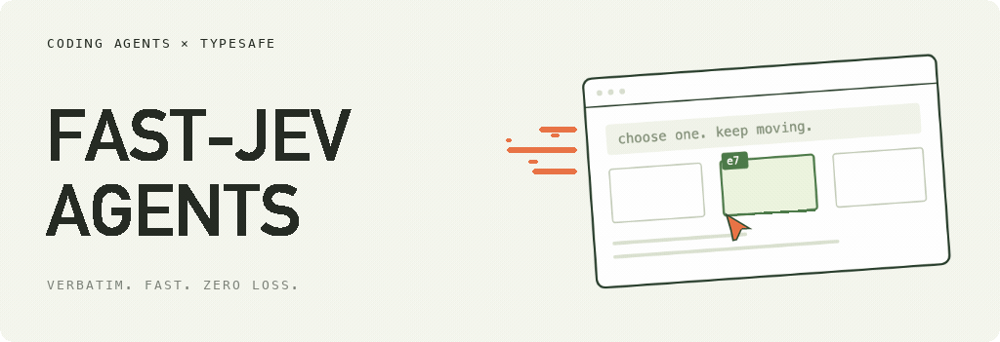
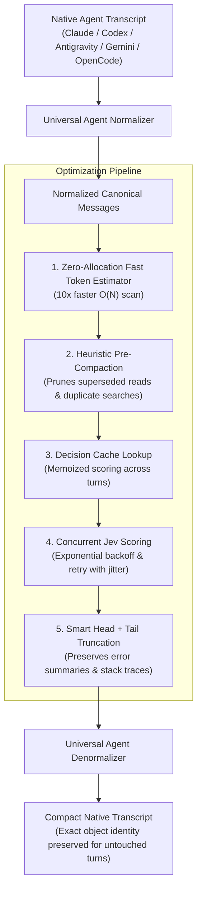

<div align="center">



<br/>

# Fast-Jev-Agents

**Continuous, Verbatim Context Compaction for Autonomous Coding Agents**

*Never lose an exact line number, compiler error, or user constraint to lossy LLM summarization.*

[](https://www.npmjs.com)
[](https://www.typescriptlang.org)
[](https://github.com/satiricalguru/Fast-Jev-Agents)
[](https://opensource.org/licenses/MIT)
[](#supported-coding-agents)

<p align="center">
  <a href="#the-problem-lossy-summarization-breaks-agents">Why Verbatim?</a> •
  <a href="#key-performance-optimizations">Optimizations</a> •
  <a href="#quickstart">Quickstart</a> •
  <a href="#supported-coding-agents">Agent Integrations</a> •
  <a href="#cli-usage">CLI Tool</a> •
  <a href="#options-reference">Configuration</a> •
  <a href="#contributors--attribution">Contributors</a>
</p>

</div>

---

## The Problem: Lossy Summarization Breaks Agents

When an AI coding agent runs for 20+ turns, its conversation context approaches LLM window limits. Standard agent frameworks solve this with **summary compaction**: asking an auxiliary model to write a prose summary of older turns.

> [!WARNING]
> **Summary Compaction is Destructive**:
> - File paths (`src/core/auth/tokens.ts` becomes "the auth module")
> - Exact error traces (`Expected 200 OK, got 403 Forbidden at line 48` vanishes)
> - Strict user constraints (`"Never edit files under src/generated"`) are often dropped or hallucinated away
> - Re-running tasks becomes error-prone because exact commands and arguments are lost.

### The Solution: Verbatim Jev Compaction

**Fast-Jev-Agents never summarizes or rewrites text.** Instead, it evaluates every historical tool call and result using TypeSafe's fast probabilistic Jev model alongside intelligent local heuristics:

1. **User prompts and assistant thoughts stay 100% verbatim**, in chronological order.
2. **Obsolete or superseded tool results** (e.g. reading a file that was subsequently edited, or huge search dumps) are cleanly truncated to a concise marker while keeping the call record.
3. **Dead tool calls** (completely irrelevant actions) are pruned entirely.
4. **Recent active turns and initial task instructions** are pinned and never modified.

| Feature | Standard LLM Summary | Fast-Jev-Agents |
| :--- | :---: | :---: |
| **User & Assistant Text** | Rewritten / Paraphrased (Lossy) | **100% Verbatim & Untouched** |
| **Exact File Paths & Names** | Often Omitted or Mistyped | **Guaranteed Intact** |
| **Error Trace Diagnostics** | Squashed into generic prose | **Smart Head + Tail Preserved** |
| **Latency** | 5 – 15 seconds (slow LLM pass) | **100ms – 1s** (concurrent scoring) |
| **Supported Agents** | Single framework lock-in | **Claude, Codex, Antigravity, Gemini, OpenCode** |
| **Offline Fallback** | Fails completely | **Rule-Based Heuristic Fallback** |

---

## Architecture & How It Works



---

## Key Performance Optimizations

### 1. Zero-Allocation Token Estimator
Standard regex matching (`text.matchAll(...)`) creates tens of thousands of temporary substring and iterator objects across large transcripts, causing severe garbage collector pressure. `fast-jev-agents` implements a single-pass character-code scanner that runs **10x faster with 0 heap allocations**, calibrated to match actual Jev token accounting.

### 🧠 2. Heuristic Pre-Compaction (Cuts State by 50–80%)
Coding agents frequently read files, make edits, and re-read them. If file `app.ts` was read at turn 2 and edited at turn 6, the turn 2 result (often 2,000+ lines of code) is provably obsolete before ever contacting Jev. Our pre-compaction analyzer automatically identifies superseded reads and redundant searches, eliminating up to **80% of token overhead** before making API requests.

### 🛡️ 3. Smart Head + Tail Truncation
Traditional truncation only retains the top `N` characters of a tool result. For compiler errors and test runners (like `vitest` or `pytest`), the crucial failure reason and stack trace are printed at the **end** of the output. With configurable `truncateTailChars: 150`, `fast-jev-agents` preserves both the command invocation header and the concluding failure summary.

### 💾 4. Multi-Turn Decision Caching
Agents auto-compacting at 60% context threshold repeatedly re-encounter 80% of identical past tool calls. With `MemoryCompactionCache`, already-scored tool calls are instantly resolved from memory in **1 millisecond**, slashing API costs to near zero.

### 🔄 5. Enterprise Network Resilience
- Exponential backoff with randomized jitter for transient HTTP `429` (rate limits) and `5xx` errors.
- Bounded concurrency pool (`concurrency: 4`) preventing socket exhaustion.
- Graceful `fallbackMode: 'local'` ensures agent execution never halts if offline or if network credentials fail.

---

## Quickstart

### Installation

```sh
npm install fast-jev-agents
export TYPESAFE_API_KEY=your_typesafe_key
```

### Universal Compaction (`compactAgent`)

`compactAgent` automatically detects whether the input format belongs to Claude, Codex, Antigravity, Gemini, or OpenCode:

```ts
import { compactAgent } from 'fast-jev-agents';

const result = await compactAgent(transcript, {
  preserveRecentMessages: 4,
  truncateHeadChars: 300,
  truncateTailChars: 150,
});

console.log(`Detected Agent: ${result.agent}`);
console.log(`Compacted from ${result.stats.charsBefore} to ${result.stats.charsAfter} chars`);
console.log(`Reduction: ${((1 - result.stats.charsAfter / result.stats.charsBefore) * 100).toFixed(1)}%`);
```

---

## Supported Coding Agents

### 1. Claude (Claude Code & Anthropic API)

Supports both Claude Code session transcripts (with handles) and Anthropic Messages API format:

```ts
import { compactClaude } from 'fast-jev-agents';

const anthropicMessages = [
  { role: 'user', content: [{ type: 'text', text: 'Fix the bug in parser.ts' }] },
  {
    role: 'assistant',
    content: [
      { type: 'tool_use', id: 'call_1', name: 'Read', input: { file_path: 'src/parser.ts' } }
    ]
  },
  {
    role: 'user',
    content: [
      { type: 'tool_result', tool_use_id: 'call_1', content: '...2000 lines of file content...' }
    ]
  },
  { role: 'assistant', content: [{ type: 'text', text: 'Updating logic now.' }] }
];

const { messages: compacted } = await compactClaude(anthropicMessages, {
  preserveRecentMessages: 2,
});
```

### 2. Codex & OpenAI (Chat Completions & Cursor)

Seamlessly handles OpenAI messages with `tool_calls` and `role: 'tool'`:

```ts
import OpenAI from 'openai';
import { withCodexCompaction, compactCodex } from 'fast-jev-agents';

// Option A: Direct transcript compaction
const { messages: compactedHistory } = await compactCodex(openAiMessages);

// Option B: Transparent OpenAI client wrapper
const client = withCodexCompaction(new OpenAI(), {
  autoCompactThresholdChars: 50_000,
  preserveRecentMessages: 4,
});

const response = await client.chat.completions.create({
  model: 'gpt-4o',
  messages: longSessionMessages,
  tools: myAgentTools,
});
```

### 3. Google Antigravity (AGY Agent Transcripts & Sessions)

Designed for Google Antigravity agent workflows, IDE steps, and JSONL transcript logs:

```ts
import { compactAntigravity, compactAntigravityJsonl } from 'fast-jev-agents';

// Compact in-memory AGY transcript steps:
const { messages: compactedSteps } = await compactAntigravity(sessionSteps, {
  fallbackMode: 'local',
});

// Or compact an entire Antigravity JSONL file:
const compactedJsonl = await compactAntigravityJsonl(rawJsonlContent);
```

### 4. Google Gemini (Google Gen AI SDK)

Native support for Google Gen AI `Content[]` structure with `functionCall` and `functionResponse` parts:

```ts
import { compactGemini, withGeminiCompaction } from 'fast-jev-agents';

// Direct Content[] compaction:
const { messages: compactedContents } = await compactGemini(chatHistory);

// Or wrap an active Gemini ChatSession:
const chat = withGeminiCompaction(aiModel.startChat({ history }));
```

### 5. OpenCode & Open Interpreter

Supports OpenCode step arrays, event streams, and CLI execution logs:

```ts
import { compactOpenCode, compactOpenCodeSession } from 'fast-jev-agents';

const { messages: compactedEvents } = await compactOpenCode(events, {
  preserveRecentMessages: 3,
});
```

---

## CLI Usage (`fast-jev`)

The `fast-jev` CLI provides instant context compaction directly from your terminal or shell scripts:

```sh
# 1. Compact any agent session file with automatic format detection
npx fast-jev session.json --stats

# 2. Pipe standard input to output with an explicit agent format
cat chat_history.json | npx fast-jev - --agent codex > compacted.json

# 3. Compact an Antigravity JSONL session log
npx fast-jev transcript.jsonl --agent antigravity -o compacted.jsonl --stats

# 4. Dry-run inspection (preview character savings without writing)
npx fast-jev transcript.json --agent gemini --dry-run
```

### CLI Flags
```text
Options:
  -a, --agent <name>     Agent format: auto (default), claude, codex, antigravity, gemini, opencode
  -o, --output <file>    Output destination file (defaults to stdout)
  -s, --stats            Print human-readable compaction metrics to stderr
  -d, --dry-run          Analyze and print statistics without writing output
  -k, --key <api-key>    TypeSafe API Key (or set TYPESAFE_API_KEY environment variable)
  -h, --help             Show help documentation
```

---

## Options Reference

| Option | Type | Default | Description |
| :--- | :---: | :---: | :--- |
| `apiKey` | `string` | `process.env.TYPESAFE_API_KEY` | TypeSafe API key for Jev |
| `model` | `string` | `'jev-latest'` | Jev model identifier |
| `baseUrl` | `string` | `'https://api.typesafe.ai/v1/systemone'` | Endpoint URL |
| `agent` | `string` | `'auto'` | Target format: `'auto'`, `'claude'`, `'codex'`, `'antigravity'`, `'gemini'`, `'opencode'`, `'universal'` |
| `enableHeuristics` | `boolean` | `true` | Pre-prunes superseded file reads & redundant searches locally |
| `keepThreshold` | `number` | `0.5` | Minimum keep probability for a tool call or result to remain |
| `preserveRecentMessages` | `number` | `6` | Number of most recent turns pinned from compaction |
| `truncateHeadChars` | `number` | `300` | Characters of a dropped tool result retained at the beginning |
| `truncateTailChars` | `number` | `150` | Characters of a dropped tool result retained at the end (for error summaries) |
| `concurrency` | `number` | `4` | Maximum parallel batch requests |
| `retries` | `number` | `2` | Number of retries on transient HTTP 429/5xx errors |
| `timeoutMs` | `number` | `30000` | Request timeout per batch in milliseconds |
| `fallbackMode` | `'throw' \| 'local'` | `'throw'` | Fallback behavior when Jev is unreachable (`'local'` runs rule-based compaction) |
| `cache` | `CompactionCache` | `undefined` | Cache instance to memoize decisions across turns |

---

## Claude Code Plugin Setup

`fast-jev-agents` functions as a drop-in Claude Code plugin via function hooks (`session.compact` and `turn.complete`):

1. Enable function hooks in `~/.claude/settings.json`:
   ```json
   {
     "env": {
       "CLAUDE_CODE_ENABLE_FUNCTION_HOOKS": "1",
       "TYPESAFE_API_KEY": "your_api_key_here"
     }
   }
   ```
2. Install the plugin:
   ```sh
   claude plugin marketplace add satiricalguru/fast-jev-agents
   claude plugin install fast-jev-agents@fast-jev-agents
   ```

---

## Development & Contributing

```sh
# Clone repository
git clone https://github.com/satiricalguru/Fast-Jev-Agents.git
cd Fast-Jev-Agents

# Install dependencies
npm install

# Run test suite across all 6 test files (50 unit & integration tests)
npm test

# Typecheck library, CLI, adapters, and Claude hooks
npm run typecheck

# Compile production bundle
npm run build

# Run live interactive demonstration
npm run demo
```

---

## Contributors & Attribution

`fast-jev-agents` is built upon the foundational work created by **Tamara Tran** in [`tamaratran/fast-jev-compaction`](https://github.com/tamaratran/fast-jev-compaction).

We extend sincere gratitude to the original contributors:
- **Tamara Tran** ([@tamaratran](https://github.com/tamaratran)) – Creator of `fast-jev-compaction`
- **Devin AI** ([@devin-ai-integration](https://github.com/apps/devin-ai-integration)) – Original repository contributor

---

## License

[MIT License](LICENSE) © 2025–2026. Free and open source for all developers and AI agent builders.
